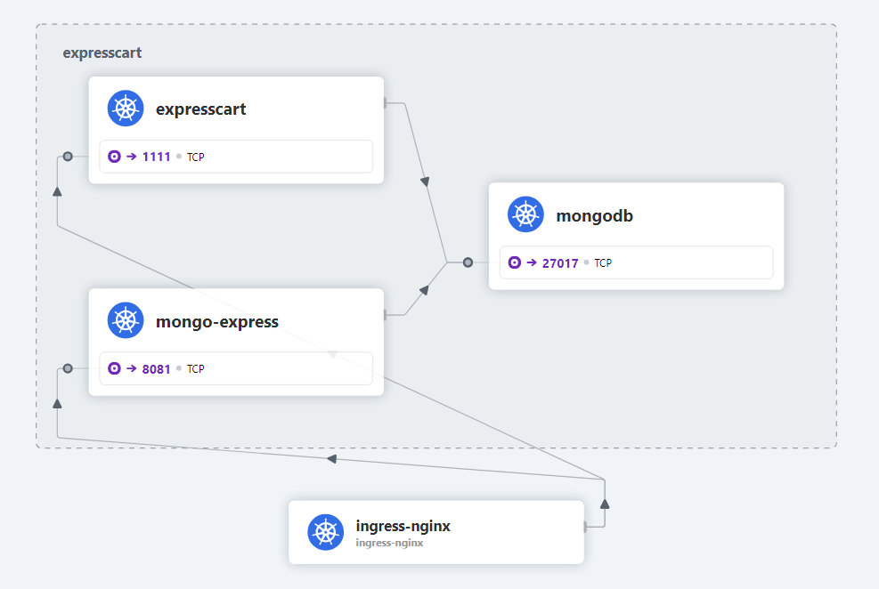
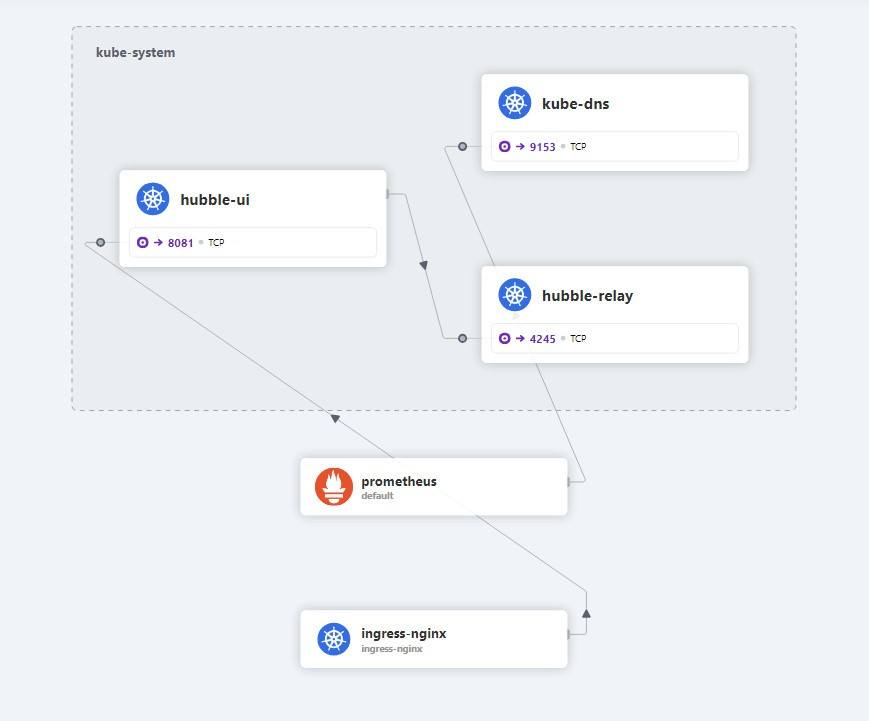
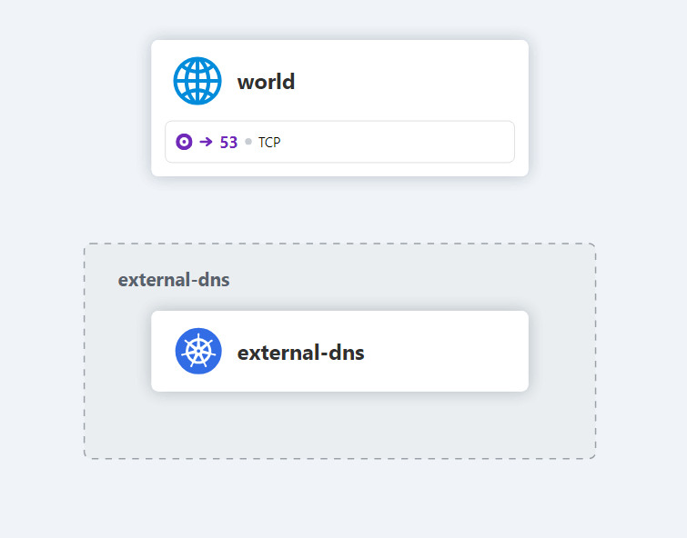
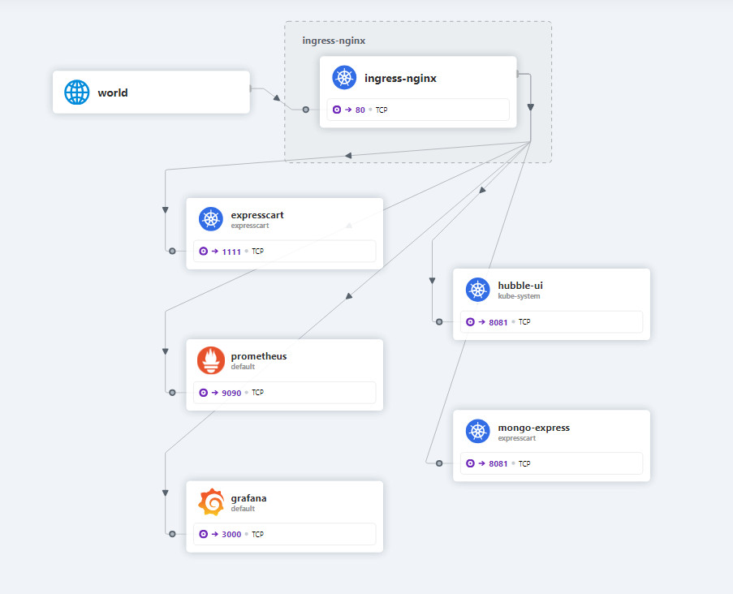
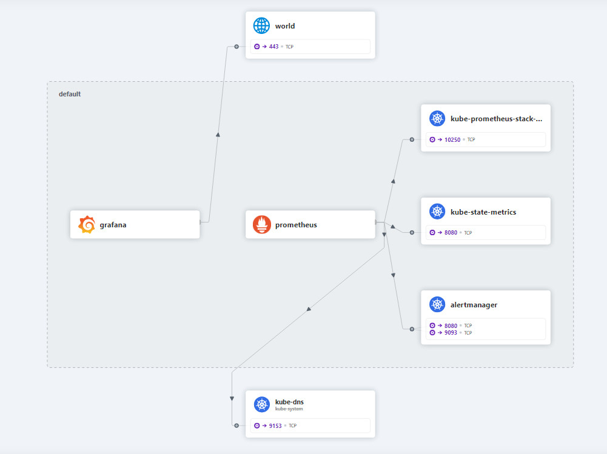

# Kube-Env
Building Bare-Metal Kubernetes development environment with demo application using [expressCart](https://github.com/mrvautin/expressCart)

### Preperation
- Setup local DNS server support rfc2136 zone transfer
- Setup local Router support BGP peering, for example VyOS virtual router. Setup remtoe AS to worker nodes
```
set protocols bgp 65400 neighbor 192.168.88.111 remote-as 65400
set protocols bgp 65400 neighbor 192.168.88.112 remote-as 65400
set protocols bgp 65400 neighbor 192.168.88.111 address-family ipv4-unicast
set protocols bgp 65400 neighbor 192.168.88.112 address-family ipv4-unicas
```

### Network information (Adjusted ymal files according to your enviornment)
- External client network 192.168.0.0/24
- DNS server 192.168.0.254
- Router connected client (192.168.0.253) and Kubernetes network (192.168.88.2)
- Kubernetes server node 192.168.88.0/24
- Kubernetes pod-network-cidr 10.0.0.0/16
- Kubernetes external load balancer IP pool 192.168.89.0/24


### Building Kubernetes cluster VM using Packer with VMWare workstation

[Create a 3-node cluster (1 x control + 2 worker nodes)](./Packer/README.md) with
- [Kubernets cluster](https://kubernetes.io/docs/concepts/overview/) version 1.27 
- [Conatinerd](https://kubernetes.io/docs/setup/production-environment/container-runtimes/#containerd) [(CRI)](https://kubernetes.io/docs/concepts/architecture/cri/) 
- [Cilium](https://docs.cilium.io/en/latest/overview/intro/) (CNI, LoadBalancer, IPPool, BGP, WireGuard Transparent Encryption) 
- [Ingress-Nginx Controller](https://kubernetes.github.io/ingress-nginx/)

> **Note**

> Install different version of Kubernets required to update ['K8S-Containerd-Cilium.sh'](./Packer/files/K8S-Containerd-Cilium.sh) under packer folder

> Install other version of Ingress-NGINX check [Supported Versions table](https://github.com/kubernetes/ingress-nginx?tab=readme-ov-file#supported-versions-table) for the comptaibility  

## Kubernetes application deployment

### 1. Deploy [external-dns](https://github.com/kubernetes-sigs/external-dns) with RBAC
```
kubectl apply -f .\manifest\externalDNS.yml
```

### 2. Deploy namepsace, configMap, Secret, IPPool, setup BGP peering
``` 
kubectl apply -f .\manifest\expressCart-Config.yml 
```

### 3. Create [expressCart](./blob/main/manifest/expresscart-Application.yaml) Application
Create deployment plan, Pod and Services, ingress, network policy and load balancer for Hubble, Prometheus and Grfrana 
```
kubectl apply -f .\manifest\expresscart-Application.yaml"
```
> **Note**

> The expresscart application image pointed to local docker repo. Update the image path 'repo.lab/expresscart:1.0.2' if different

### 4. Deploy [Prometheus](https://github.com/prometheus/prometheus) and [Grafana](https://github.com/grafana/grafana) using [Helm chart](https://github.com/prometheus-community/helm-charts/tree/main/charts/kube-prometheus-stack)
```
helm repo add prometheus-community https://prometheus-community.github.io/helm-charts
helm repo update
kubectl create namespace prometheus-stack
helm install -n prometheus-stack --version "51.5.3"\
    prometheus prometheus-community/kube-prometheus-stack -f .\manifest\prometheus-stack-myvalues.51.5.3.yaml
```

### 5. Update Alert Manager to send message to Slack
- Create the Slack channel and incoming Webhook URL
- Use OpenLens, goto secret, edit alertmanager-prometheus-stack-alertmanager	
- Update the below sections for 'alertmanager.yaml' and save. Note : replace api_url with your Slack Webhook URL
```
global:
  resolve_timeout: 1m
receivers:
- name: "slack-notification"
  slack_configs:
  - api_url: "https://hooks.slack.com/services/XXXXX"       
    send_resolved: true
    channel: "#homelab-kubernetes-alert"
route:
  group_by:
  - namespace
  group_interval: 1m
  group_wait: 30s
  receiver: "slack-notification"
  repeat_interval: 15m
  routes:
  - matchers:
    - alertname =~ "InfoInhibitor|Watchdog|PodNotRunning"
    receiver: "slack-notification"
```

- Check alertmanager updated the configuration or not. Note the date of "Loading configuration file" 
```
kubectl logs -n prometheus-stack pod/alertmanager-prometheus-stack-alertmanager-0
kubectl exec -n prometheus-stack pod/alertmanager-prometheus-stack-alertmanager-0 \
          -- cat /etc/alertmanager/config_out/alertmanager.env.yaml
```
### 6. Update alert rules 
> **Note**

>  Cannot directly edit the configMap object as it is managed by Prometheus Operator
- Use OpenLens to edit the rules under 'CRD/monitoring.coreos.com/PrometheusRule/prometheus-stack-alertmanager.rules'
- Find 'name: alertmanager.rules'. Under rules, add or update the rules (the following is an example), then save
```
spec:
  groups:
    - name: alertmanager.rules
      rules:
--------------
        - alert: PodNotRunning
          expr: (kube_pod_container_status_terminated_reason {reason="Error"} or kube_pod_container_status_waiting)
          for: 30s
          labels:
            severity: critical
            prometheus_group: '{{ $externalLabels.prometheus_group }}'
          annotations:
            description: Pod {{$labels.namespace}}/{{ $labels.pod }} is not running
            summary: Pod is not running
---------------
```
- Use Prometheus UI to check the new alert rule has been added.
- Slack will received old message which has been fired as 'send_resolved: true' set
- Kill a expresscart pod and wait for new message

## System vertification

### Application @ Client
The user name and password are set by [expressCart](https://github.com/mrvautin/expressCart)
- http://expresscart.lab/		<- expresscart shop 
- http://expresscart.lab/admin	<- expresscart admin   -> U: owner@test.com P: test
- http://expresscart.lab/mongo	<- mongoexpress		   -> U: expresscart P: expresscart

### System tools @ Client
- http://hubble.lab
- http://prometheus.lab
- http://grafana.lab		    -> U: admin P:prom-operator, or U: admin P:admin

### WireGuard Pod-to-Pod encryption @ control node
```
kubectl -n kube-system exec -ti ds/cilium -- bash
apt-get update
apt-get -y install tcpdump
tcpdump -n -i cilium_wg0	//Access application and there should be traffic flow using interface wg0
```

### Hubble-observability

ExpressCart Application Namespace


Kube-System Namespace


External-dns Namespace


Ingress-NGINX Namespace


Default Namespace



## [CI/CD pipeline](./pipeline)

- Application project saved into local GitLab source code repository 

- GitLab CI/CD Runner scan code when project committed using SonarQube

- Jenkins scan GitLab project. Jenkins node running application testing and container image build

- Container image stored into local Docker Register


