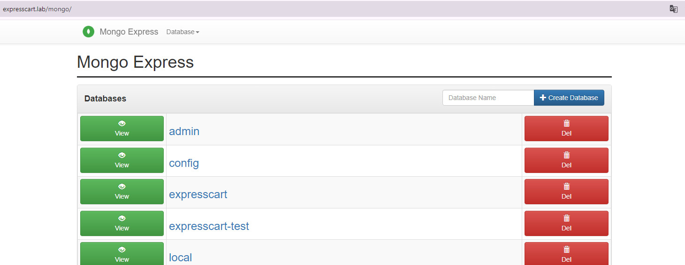

# Kube-Env
Building Bare-Metal Kubernetes development environment with demo application using [`expressCart`](https://github.com/mrvautin/expressCart)

### Preperation
- Setup local DNS server support rfc2136 zone transfer
- Setup local Router support BGP peering, for example VyOS virtual router. Setup remtoe Autonomous Systems (AS) with worker nodes
```
#Example of VyOS
set protocols bgp 65400 neighbor 192.168.88.111 remote-as 65400
set protocols bgp 65400 neighbor 192.168.88.112 remote-as 65400
set protocols bgp 65400 neighbor 192.168.88.111 address-family ipv4-unicast
set protocols bgp 65400 neighbor 192.168.88.112 address-family ipv4-unicas
```

### Network information (Adjusted ymal files according to your enviornment)
- External client network 192.168.0.0/24
- DNS server 192.168.0.254
- Router connected client (192.168.0.253) and Kubernetes network (192.168.88.2)
- Kubernetes server node 192.168.88.0/24
- Kubernetes pod-network-cidr 10.0.0.0/16
- Kubernetes external load balancer IP pool 192.168.89.0/24


### Building Kubernetes cluster VM using Packer with VMWare workstation

[Create a 3-node cluster (1 x control + 2 worker nodes)](./Packer/README.md) with
- [Kubernets cluster](https://kubernetes.io/docs/concepts/overview/) version 1.27 
- [Conatinerd](https://kubernetes.io/docs/setup/production-environment/container-runtimes/#containerd) [(CRI)](https://kubernetes.io/docs/concepts/architecture/cri/) 
- [Cilium](https://docs.cilium.io/en/latest/overview/intro/) (CNI, LoadBalancer, IPPool, BGP, WireGuard Transparent Encryption) 
- [Ingress-Nginx Controller](https://kubernetes.github.io/ingress-nginx/)

> **Note**

> Install different version of Kubernets required to update [`K8S-Containerd-Cilium.sh`](./Packer/files/K8S-Containerd-Cilium.sh) under packer folder

> Install other version of Ingress-NGINX check [Supported Versions table](https://github.com/kubernetes/ingress-nginx?tab=readme-ov-file#supported-versions-table) for the comptaibility  

## Complete Kubernetes Cluster setup

### 1. Join nodes to Kubernetes Cluster

- Check the join string from "k8s-controll.install" file in control plan node 
- Join worker nodes to control plan

Example: (Run at worker nodes)
```
kubeadm join k8s-control.localdomain:6443 --token xxxxx \
        --discovery-token-ca-cert-hash sha256:xxxx
```

- Check the nodes are ready
```
kubectl get nodes
```

### 2. Label worker nodes for BGP policy
```
kubectl label nodes k8s-control.localdomain bgp-policy=homelab
kubectl label nodes k8s-worker1.localdomain bgp-policy=homelab		
kubectl label nodes k8s-worker2.localdomain bgp-policy=homelab		
```

### 3. Deploy [external-dns](https://github.com/kubernetes-sigs/external-dns) with RBAC
```
kubectl apply -f .\manifest\externalDNS.yml
```
> **Note**

> This YAML file is customized with setting of local DNS server based on [`RFC2136`](https://github.com/kubernetes-sigs/external-dns/blob/master/docs/tutorials/rfc2136.md) provider. Refer to [Tutorials](https://github.com/kubernetes-sigs/external-dns/tree/master/docs/tutorials) file for different DNS server provider. 


### 4. Deploy IPPool, setup BGP peering, Namespaces and Ingress of management software
```
kubectl apply -f .\manifest\platformConfig.yaml
```

### 5. Deploy [Argo CD](https://argo-cd.readthedocs.io/en/stable/)
- Install Argo CD via YAML. `argocd` namespace has been created in `Step 4` platform manifest above
```
kubectl apply -n argocd -f https://raw.githubusercontent.com/argoproj/argo-cd/stable/manifests/install.yaml
```
- Install `Argo CD CLI` 
```
VERSION=$(curl -L -s https://raw.githubusercontent.com/argoproj/argo-cd/stable/VERSION)
curl -sSL -o ./argocd/argocd-linux-amd64 https://github.com/argoproj/argo-cd/releases/download/v$VERSION/argocd-linux-amd64
sudo install -m 555 ./argocd/argocd-linux-amd64 /usr/local/bin/argocd
rm argocd-linux-amd64
```

- Get default `admin` password, test connection and change `admin` password
```
argocd admin initial-password -n argocd
argocd login argocd.lab --insecure --username admin --password <admin password>
argocd account update-password
```

- Creating Argo CD Apps (optional) 
```
argocd app create expresscart --repo https://github.com/AlmonChoi/Kube-Env_BareMetal.git --path manifest/app/overlays/development/ --dest-server https://kubernetes.default.svc --dest-namespace default
```

## Deploy [Prometheus](https://github.com/prometheus/prometheus) and [Grafana](https://github.com/grafana/grafana) 

### 1. Deploy using [Helm chart](https://github.com/prometheus-community/helm-charts/tree/main/charts/kube-prometheus-stack)
```
helm repo add prometheus-community https://prometheus-community.github.io/helm-charts
helm repo update
kubectl create namespace prometheus-stack
helm install -n prometheus-stack --version "54.2.2"\
    prometheus prometheus-community/kube-prometheus-stack -f .\manifest\prometheus-stack-myvalues.54.2.2.yaml
```

> **Note**

> The Helm above deploy Prometheus, AlertManager and Grafana to Kubernetes cluster. To deploy Prometheus and related component separately (e.g. Docker on other host), refer to [Prometheus](./infra/prometheus) under Infra folder.


### 2. Update AlertManager to send message to Slack
- Firstly, create the `Slack Channel` and get `incoming Webhook URL`
- Use OpenLens, edit `alertmanager-prometheus-stack-alertmanager` secret.	
- Update like below sections to `alertmanager.yaml` and save. Note : replace api_url with your `Slack Webhook URL`
```
global:
  resolve_timeout: 1m
--------------
receivers:
- name: "slack-notification"
  slack_configs:
  - api_url: "https://hooks.slack.com/services/XXXXX"       
    send_resolved: true
    channel: "#homelab-kubernetes-alert"
route:
  group_by:
  - namespace
  group_interval: 1m
  group_wait: 30s
  receiver: "slack-notification"
  repeat_interval: 15m
  routes:
  - matchers:
    - alertname =~ "InfoInhibitor|Watchdog|PodNotRunning"
    receiver: "slack-notification"
--------------

```

- If there is no error on the configuration, `prometheus-stack-operator` will generate the `alertmanager-prometheus-stack-alertmanager-generated` secret. 

- It takes 1-2 mins for alertmanager detected configuration change and perform configuration reload. Note the date/time of "Reload triggered" using the following command  
```
kubectl logs -n prometheus-stack pods/alertmanager-prometheus-stack-alertmanager-0 config-reloader
```
level=info ts=2024-06-29T20:38:27.540157914Z caller=reloader.go:376 msg="`Reload triggered`" cfg_in=/etc/alertmanager/config/alertmanager.yaml.gz cfg_out=/etc/alertmanager/config_out/alertmanager.env.yaml watched_dirs=/etc/alertmanager/config


### 3. Update AlertManager rules using CRD
> **Note**

>  Cannot directly edit the configMap object as it is managed by Prometheus Operator
- Use OpenLens to edit the rules under `CRD/monitoring.coreos.com/PrometheusRule/prometheus-stack-alertmanager.rules`
- Find `name: alertmanager.rules`. Under rules, add or update the rules (the following is an example), then save
```
spec:
  groups:
    - name: alertmanager.rules
      rules:
--------------
        - alert: PodNotRunning
          expr: (kube_pod_container_status_terminated_reason {reason="Error"} or kube_pod_container_status_waiting)
          for: 30s
          labels:
            severity: critical
            prometheus_group: '{{ $externalLabels.prometheus_group }}'
          annotations:
            description: Pod {{$labels.namespace}}/{{ $labels.pod }} is not running
            summary: Pod is not running
---------------
```
- Use `Prometheus UI` to check the new alert rule has been added

- Slack will received old message which has been fired as `send_resolved: true` set
- Kill a expresscart pod and wait for new message


## Application Deployment with [Kustomize](https://kubernetes.io/docs/tasks/manage-kubernetes-objects/kustomization/)

### Manual deploy [expressCart](./blob/main/manifest/expresscart-Application.yaml) application in `Development` mode 
``` 
kubectl apply -k .\manifest\app\overlays\development
```

> **Note**

> The expresscart application image pointed to local docker repo. Update the image path `repo.lab/expresscart` if the image stored in different location


## System vertification

### Application @ Client
The user name and password are set by [expressCart](https://github.com/mrvautin/expressCart)
- http://expresscart.lab/		


- http://expresscart.lab/admin	<- expresscart admin   -> U: owner@test.com P: test


- http://expresscart.lab/mongo	<- mongoexpress		   -> U: admin P: admin


### System tools @ Client
- http://hubble.lab
- http://prometheus.lab
- http://grafana.lab		    -> U: admin P:prom-operator, or U: admin P:admin

### WireGuard Pod-to-Pod encryption @ control node
```
kubectl -n kube-system exec -ti ds/cilium -- bash
apt-get update
apt-get -y install tcpdump
tcpdump -n -i cilium_wg0	//Access application and there should be traffic flow using interface wg0
```

### Hubble-observability

- ExpressCart Application Development Namespace


- ExpressCart Application Pod Traffic


- Kube-System Namespace


- Ingress-NGINX Namespace


- Prometheus-Stack Namespace


- External-dns Namespace


- Argo CD Namespace


## [CI/CD pipeline](./pipeline)

- Application project saved into local GitLab source code repository 

- GitLab CI/CD Runner scan code when project committed using SonarQube

- Jenkins scan GitLab project. Jenkins node running application testing and container image build

- Container image stored into local Docker Register

- ArgoCD deploy application manifest stored in GitLab source code repository 


