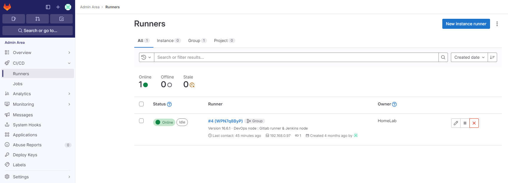
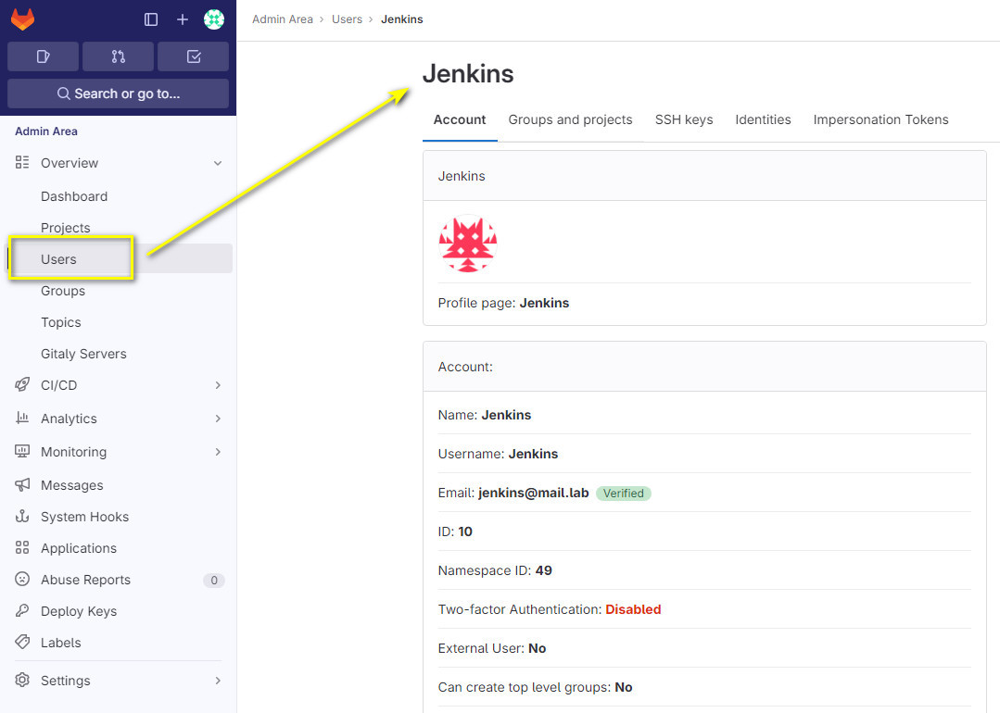
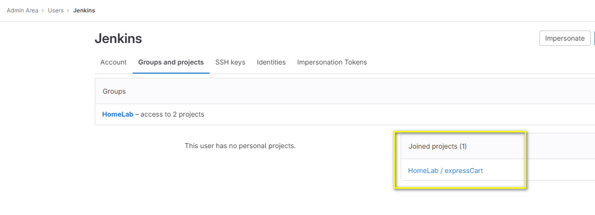
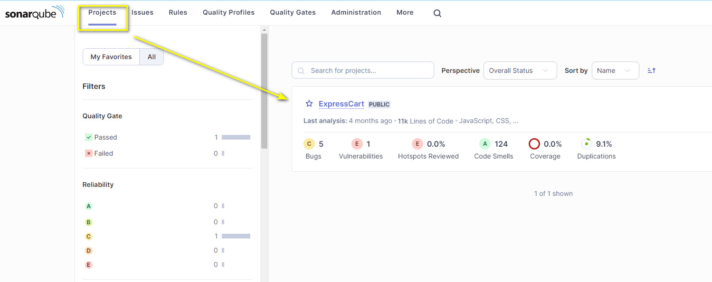

ExpressCart docker image build pipeline

# Prepreation
- GitLab
- Docker Register & UI (optional)
- Jenkins
- Sonar-Qube
- Clair

## GitLab

### Preapre [.gitlab-ci.yml](./.gitlab-ci.yml) - GitLab CI/CD and save to the Git Repo root folder

### [Create Gitlab Runners] (https://docs.gitlab.com/ee/tutorials/create_register_first_runner/index.html#create-and-register-a-project-runner)

### Create Jenkins users

### Add Jenkins as project member

## Sonar-Qube

### Insall and setup Sonar-Qube ()

### Create new Project

### Prepare ['sonar-project.properties'](./sonar-project.properties) and save to the Git Repo root folder

# Jenkins CI build docker image

- Prepare Jenkins build node
- Create multi-branch pipeline
- Run pipeline

# Automated Code Scan
Automated code scan upon Branch committed

