# ExpressCart docker image build pipeline

## Prepreation
- [GitLab](../infra/GitLab)
- [Sonar-Qube](../infra/sonarqube)
- [Jenkins](../infra/jenkins)
- [Docker Register & UI](../infra/Repo)

## GitLab

- Preapre [.gitlab-ci.yml](./.gitlab-ci.yml) - GitLab CI/CD and save to the Git Repo root folder

- Prepare [`sonar-project.properties`](./sonar-project.properties) and save to the Git Repo root folder

- Prepare [`Jenkinsfile`](./Jenkinsfile) and save to the Git Repo root folder

- [Create Gitlab Runners](https://docs.gitlab.com/ee/tutorials/create_register_first_runner/index.html#create-and-register-a-project-runner)
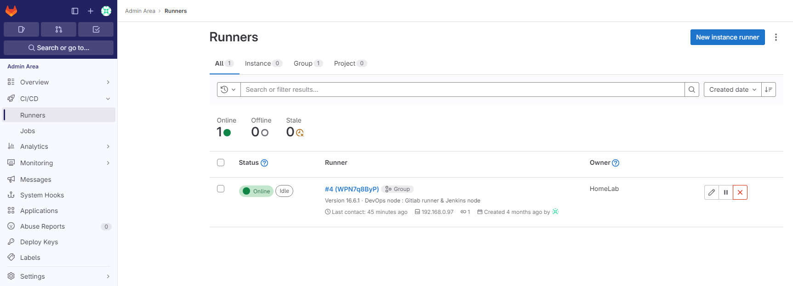

- Create Jenkins users
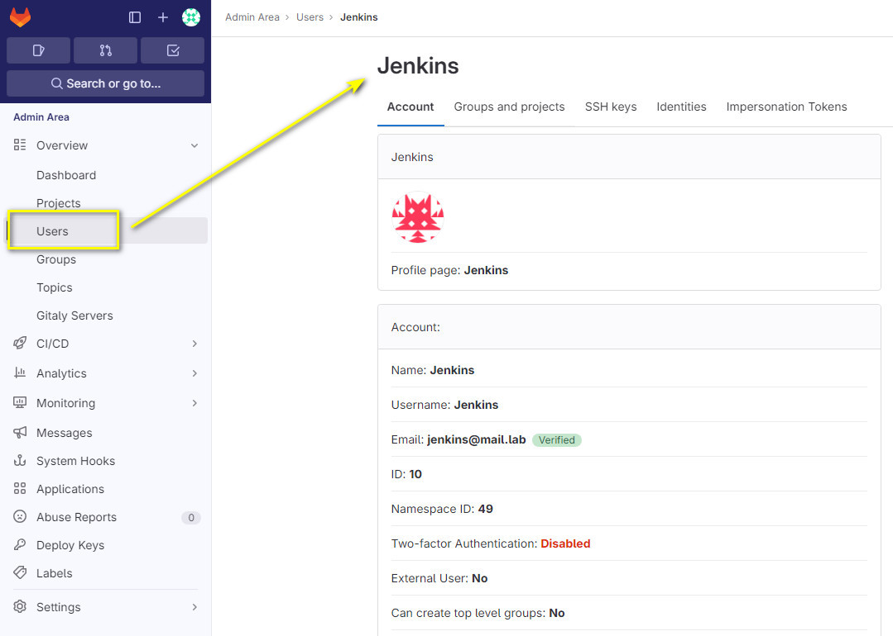

- Add Jenkins as project member
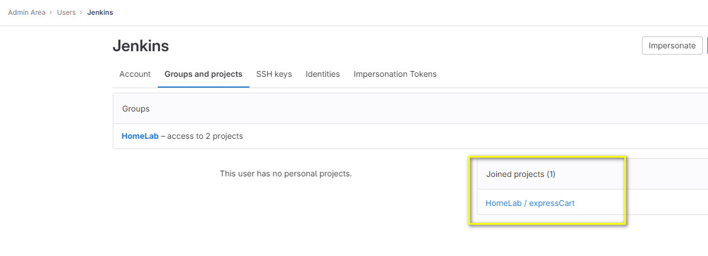

## Sonar-Qube

- Create new Project
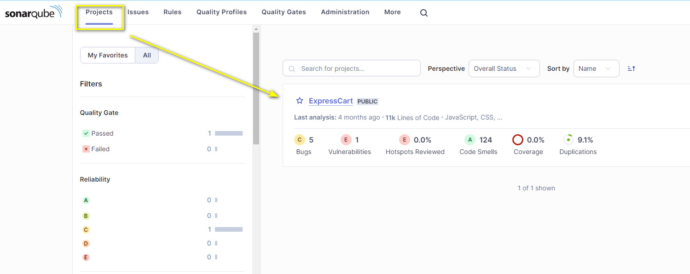

- Scan Result (scan is automatically performed by GitLab CI/CD Runner when there is project committed)
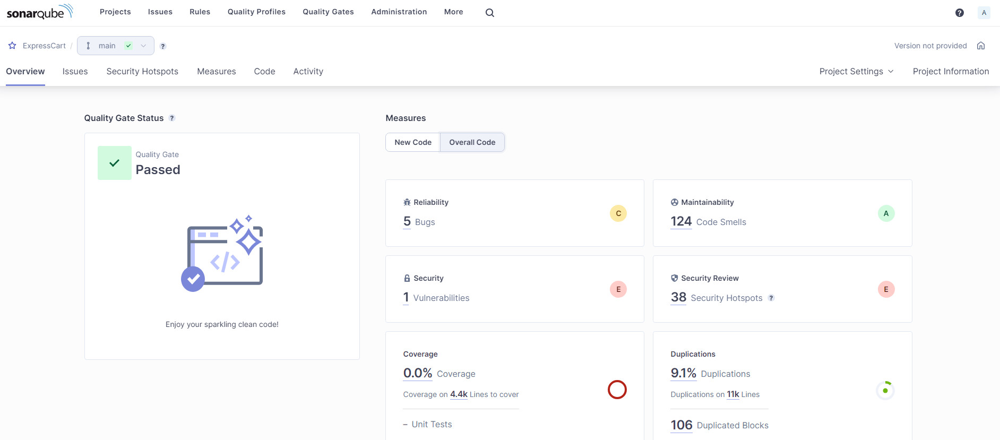

- Open and see result details

## Jenkins 

- Prepare Jenkins build node
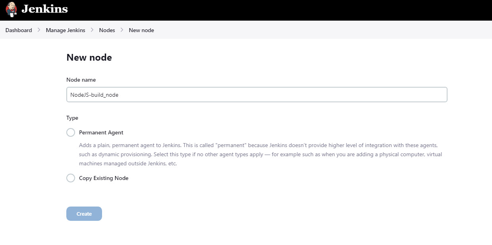

- Start and connect to Jenkins server
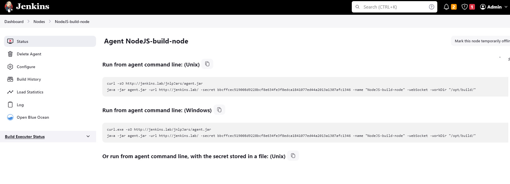

- Create credentials for connect to GitLab
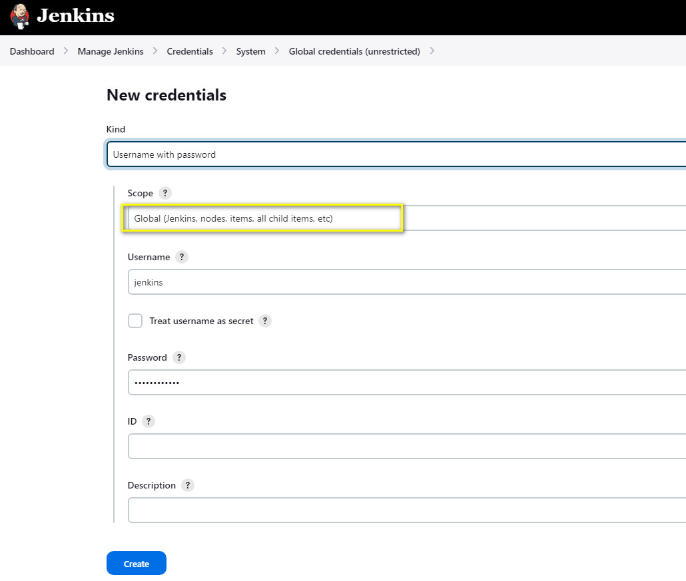

- Create multi-branch pipeline
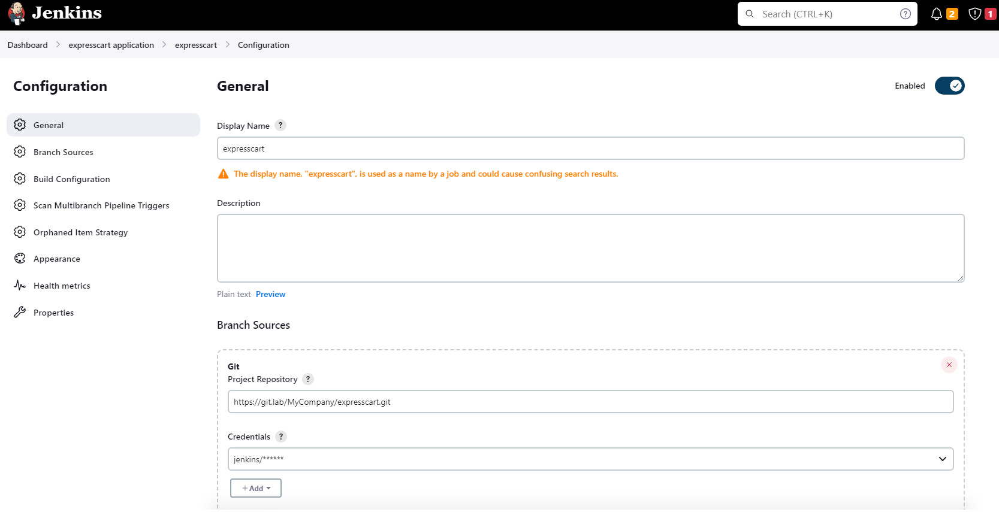

- Run pipeline
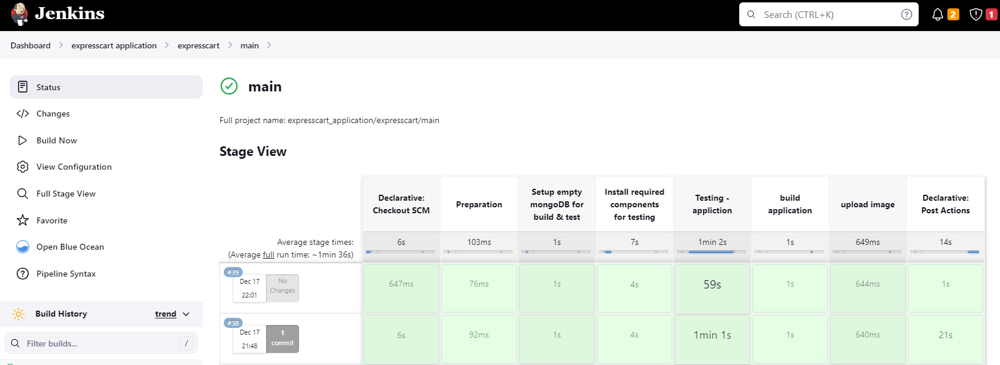

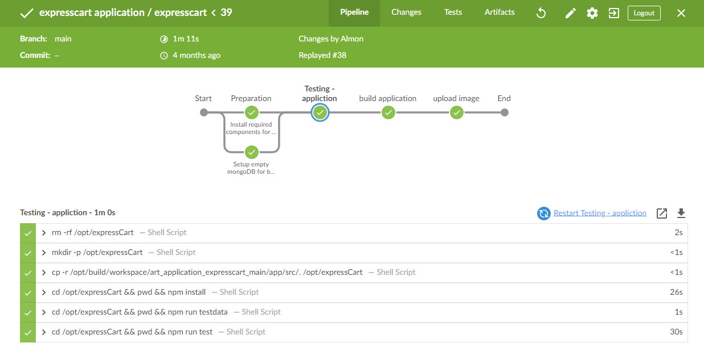

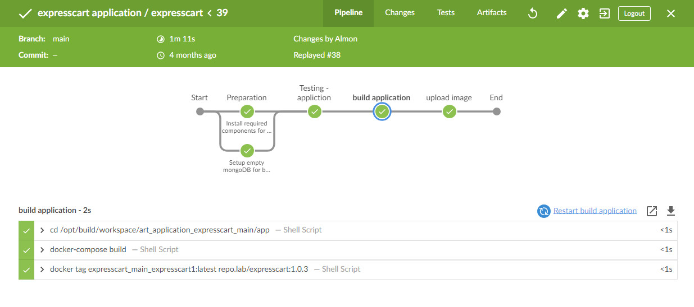

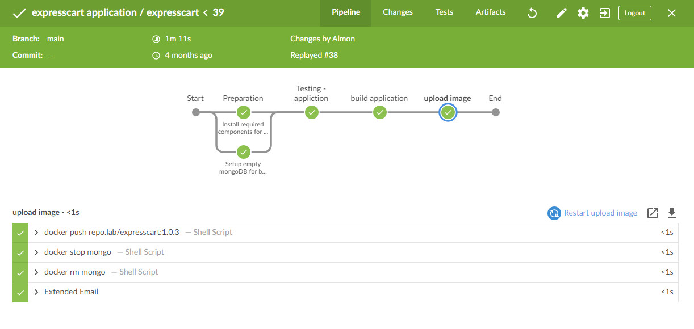

## Docker Register

