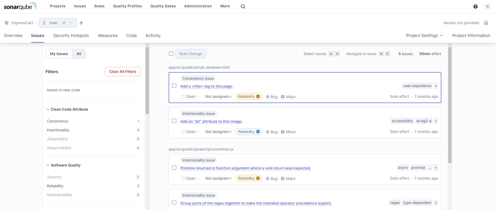
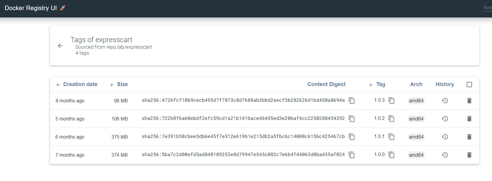

# ExpressCart docker image build pipeline

## Prepreation
- GitLab
- Sonar-Qube
- Jenkins
- Docker Register & UI 

## GitLab

- Preapre [.gitlab-ci.yml](./.gitlab-ci.yml) - GitLab CI/CD and save to the Git Repo root folder

- Prepare ['sonar-project.properties'](./sonar-project.properties) and save to the Git Repo root folder

- Prepare ['Jenkinsfile'](./Jenkinsfile) and save to the Git Repo root folder

- [Create Gitlab Runners](https://docs.gitlab.com/ee/tutorials/create_register_first_runner/index.html#create-and-register-a-project-runner)

- Create Jenkins users

- Add Jenkins as project member

## Sonar-Qube

- Create new Project

- Scan Result (scan is automatically performed by GitLab CI/CD Runner when there is project committed)

- Open and see result details

## Jenkins 

- Prepare Jenkins build node

- Start and connect to Jenkins server

- Create credentials for connect to GitLab

- Create multi-branch pipeline

- Run pipeline

## Docker Register

